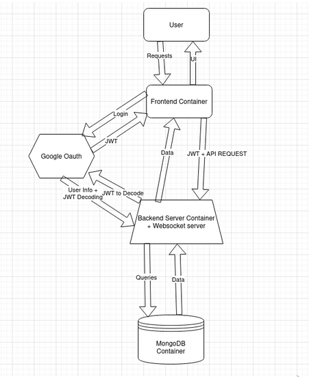

# TA Hours


This repo is for CS430 at Colby College, in which our team designed a system to to manege an organize Colby College Computer Science department's TA Hours.

## Docs:

- [backend](backend/README.md)
- [frontend](frontend/README.md)

## Quickstart:

- Make an account on google cloud services and get an Oauth Consent URI: You can find a tutorial on how to do this [here](https://www.youtube.com/watch?v=A3838fq6j4U).
- Fill out the `.txt` files in the `secrets` folder. To do this, make copies of all the `.example` files in the folder and copy them to just be `.txt` files. After this, fill out all the fields as requested in the files.
- Next, in `frontend/src/types/socketEvents.ts`, change the IP address in the `PROD_SOCKET_URI` to whichever IP you want to run it on (maybe change this in the future so it is not hard coded).
- In the `frontend/vite.config.ts` file, under `preview:{allowedHosts}`, add to the list to DNS you want to run the project on.
- Next (assuming you have docker), in the root, run:

```sh
make all
```

- Afterwards, to run the project, run

```sh
make run
```

- To shut it down, run

```sh
make destroy
```

- And to get rid of the volumes (due to how it is building currently, you have to do this every time), run:

```sh
make prune
```

The default port is `3001`.

## System Design



## File Structure:

```
.
├── backend
├── count_line.sh
├── database
│  ├── mongo-dump
│  │  └── TAHours
│  │     ├── posts.bson
│  │     ├── posts.metadata.json
│  │     ├── users.bson
│  │     └── users.metadata.json
│  └── testdata
│     └── TAHours
│        ├── cs_classes.bson
│        ├── cs_classes.metadata.json
│        ├── posts.bson
│        ├── posts.metadata.json
│        ├── ta_queues.bson
│        ├── ta_queues.metadata.json
│        ├── tickets.bson
│        ├── tickets.metadata.json
│        ├── users.bson
│        └── users.metadata.json
├── docker-compose.yml
├── frontend
├── gorilla
│  └── gorilla.jpg
├── Makefile
├── mongorestore.sh
├── README.md
├── secrets
│  ├── backend_env.txt.example
│  ├── frontend_env.txt.example
│  ├── mongo_pass.txt.example
│  └── mongo_user.txt.example
└── Useful_Queries.md
```


