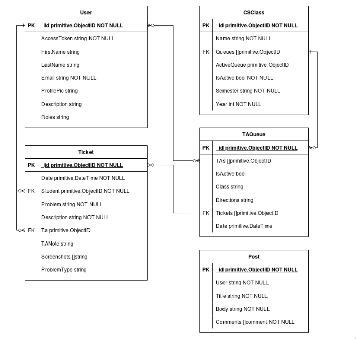

# Backend

- [Home](./../README.md)

## General Overview

The backend uses a very general MRC architecture:

- Routes are handled in the `routes` folder.
- Models are handled in the `models` folder.
- Controllers are handled in the `controllers` folder.

Authentication is handled with the JWT tokens provided by Oauth. We have two middleware to handle this:

- `auth_middleware.go` decodes the JWT from Google and gets basic info, such as the email of the user. This is good for routes every logged in user can access.
- `user_middleware.go` queries the db and finds all information on the user. This is needed for routes in which only users specific roles can access. For example, only professors should be able to create classes.

## Run Command

The micro service can be run by running the `main.go` file. From the root, you can run:

```sh
go run cmd/server/main.go
```

## Database ER Diagram



## File Structure

```.
├── app
│  └── app.go
├── cmd
│  └── server
│     └── main.go
├── controllers
│  ├── cs_class_controller.go
│  ├── post_controller.go
│  ├── ta_queue_controller.go
│  ├── ticket_controller.go
│  └── user_controller.go
├── db
│  └── connect_to_mongo.go
├── Dockerfile
├── go.mod
├── go.sum
├── middleware
│  ├── auth_middleware.go
│  └── user_middleware.go
├── models
│  ├── consts.go
│  ├── cs_class_model.go
│  ├── post_model.go
│  ├── ta_queue_model.go
│  ├── ticket_model.go
│  └── user_model.go
├── README.md
├── routes
│  ├── cs_class_router.go
│  ├── post_router.go
│  ├── ta_queue_router.go
│  ├── ticket_router.go
│  └── user_router.go
├── socket
│  └── socket_server.go
├── tests
│  ├── python
│  │  └── requirements.txt
│  ├── singletests
│  │  ├── classes
│  │  │  ├── create_cs_class.sh
│  │  │  ├── create_cs_class_2.sh
│  │  │  ├── create_cs_class_3.sh
│  │  │  ├── create_ta_queue.sh
│  │  │  ├── create_ta_queue_2.sh
│  │  │  ├── get_all_active.sh
│  │  │  ├── get_cs_class.sh
│  │  │  ├── set_active_1.sh
│  │  │  └── set_active_2.sh
│  │  ├── posts
│  │  │  ├── create_comment.sh
│  │  │  ├── create_comment_2.sh
│  │  │  ├── create_post.sh
│  │  │  ├── create_post_2.sh
│  │  │  ├── create_post_3.sh
│  │  │  └── get_all_posts.sh
│  │  ├── taqueue
│  │  │  ├── active_tickets.sh
│  │  │  ├── add_ta.sh
│  │  │  ├── get_taqueue.sh
│  │  │  └── remove_ta.sh
│  │  ├── tickets
│  │  │  ├── create_ticket.sh
│  │  │  ├── get_ticket.sh
│  │  │  ├── get_user_tickets.sh
│  │  │  └── resolve_ticket.sh
│  │  └── user
│  │     ├── create_user.sh
│  │     ├── create_user_2.sh
│  │     ├── create_user_3.sh
│  │     ├── get_user.sh
│  │     ├── simple_test.sh
│  │     ├── update_description.sh
│  │     ├── update_profile_pic.sh
│  │     ├── update_roll_prof.sh
│  │     ├── update_roll_student.sh
│  │     └── update_roll_ta.sh
│  └── suites
│     ├── cs_class_test.go
│     ├── post_test.go
│     ├── ta_queue_test.go
│     ├── ticket_test.go
│     └── user_test.go
└── utils
   ├── load_secret.go
   └── validate.go

```
